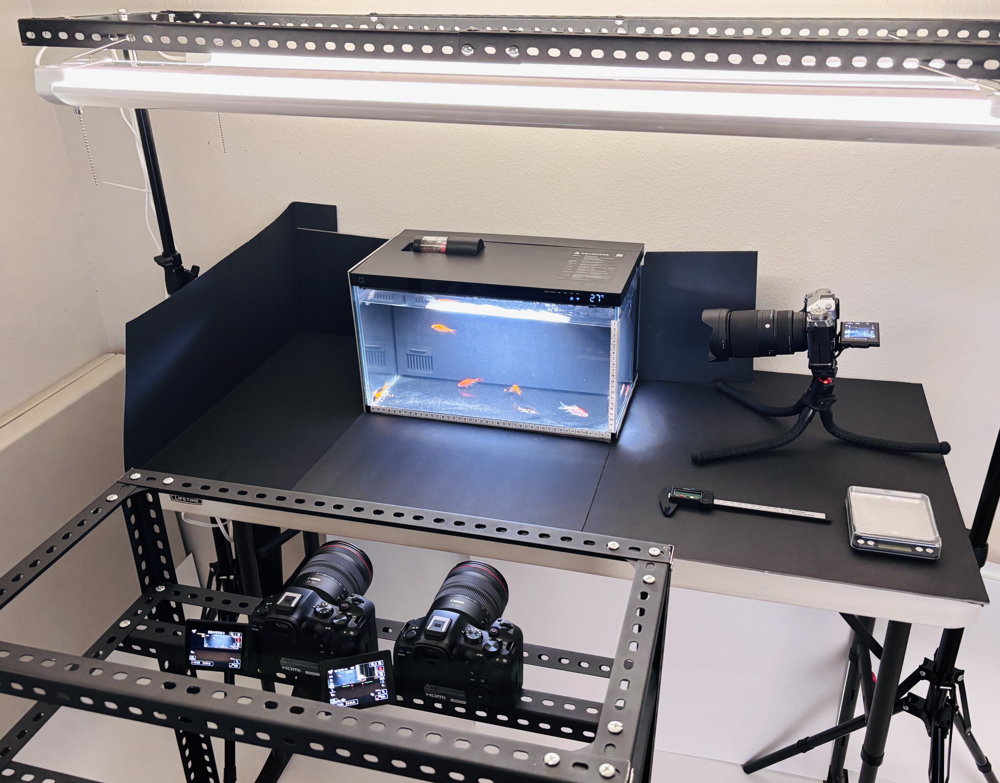

<table>
  <tr>
    <td width="50%" align="center">
      
    </td>
    <td width="50%" align="center">
      
    </td>
  </tr>
  <tr>
    <td align="center"><b>Experiment Setting</b></td>
    <td align="center"><b>Detection & Tracking</b></td>
  </tr>
</table>
